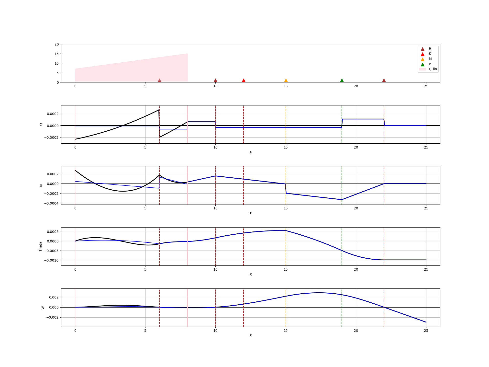

<!DOCTYPE html>
<body>

<h1>Beam Bending Analysis Project</h1>

    <strong>Beam Bending Analysis</strong> is a classic strength-of-materials problem.
    The beam has a length of 25 units and is subjected to distributed loads,
    concentrated forces, and moments. It is supported by pin, fixed, and elastic
    supports at specified points. Two independent approaches are implemented:

<ul>
    <li>
        <strong>Analytical solution</strong> – written in SageMath using the
        initial parameters method with Heaviside functions.
    </li>
    <li>
        <strong>Numerical solution</strong> – a finite element method (FEM)
        implemented in C++ (stiffness matrix assembly and solving a linear system).
    </li>
</ul>

    Results from both methods are compared and visualised with a Python script.

<h2>Project Structure</h2>

    beam-bending-analysis/ 
    ├── data/                     # Input data 
    │   ├── parameters.txt        # Physical parameters (P, M, Q1, Q2, K, E, J) 
    │   ├── coordinates.txt       # Coordinates of characteristic points 
    │   └── Балка_2025.xlsx       # Loading scheme (Excel file) 
    ├── src/ 
    │   ├── sage/                 # Analytical solution (Sage) 
    │   │   ├── beams_bending.sage 
    │   │   └── beams_bending.py 
    │   ├── fem/                  # Finite element method (C++) 
    │   │   └── beams_bending.cpp 
    │   └── plotting/             # Visualisation 
    │       └── paint.py 
    ├── results/                  # Output data 
    │   ├── sage_res_*.txt        # Deflections, angles, moments, forces (Sage) 
    │   ├── FEM_res_*.txt         # Same for FEM 
    │   └── result_plot.png       # Comparative plots 
    ├── parameters.txt → data/parameters.txt   # Symlinks for convenience 
    ├── coordinates.txt → data/coordinates.txt 
    ├── README.md 
    ├── README.html 
    └── .gitignore

<h2>Requirements</h2>
<table>
    <tr>
        <th>Component</th>
        <th>Required software / versions</th>
    </tr>
    <tr>
        <td>Sage solution</td>
        <td>SageMath ≥ 9.0 (supports symbolic computation and <code>desolve</code>)</td>
    </tr>
    <tr>
        <td>C++ FEM</td>
        <td>C++17 compiler (g++, clang), standard library</td>
    </tr>
    <tr>
        <td>Python plotting</td>
        <td>Python 3, <code>matplotlib</code>, <code>numpy</code></td>
    </tr>
</table>

<!-- ========== PART 2: Quick Start, Results, License, Author ========== -->

<h2>Quick Start</h2>

    The easiest way to run the entire pipeline (analytical solution, FEM, and plotting)
    is to use the provided <strong>Makefile</strong> in the project root.

    <h4>Using Make (recommended)</h4>
    <pre><code>make all</code></pre>
    

        This will compile the C++ FEM program (if needed), run the Sage analytical solution,
        execute the FEM simulation, and finally generate the comparison plot.
        All results will be saved in the <code>results/</code> folder.
    

    
Other useful Make targets:

    <ul>
        <li><code>make sage</code> – only the analytical solution</li>
        <li><code>make fem</code> – compile and run the FEM code</li>
        <li><code>make plot</code> – generate the plot (runs Sage and FEM if necessary)</li>
        <li><code>make clean</code> – remove all generated files (results, executable)</li>
        <li><code>make rebuild</code> – clean + all</li>
    </ul>

    <h4>Manual run (step by step)</h4>
    

        If you prefer to run each component separately, follow these steps from the project root:
    

    <ol>
        <li>
            <strong>Sage (analytical solution)</strong>
            <pre><code>cd src/sage
sage beams_bending.sage</code></pre>
            

                Output files (<code>sage_res_*.txt</code>) will appear in <code>results/</code>.
            

        </li>
        <li>
            <strong>C++ FEM (numerical solution)</strong>
            <pre><code>cd src/fem
g++ -std=c++11 -Wall -O2 beams_bending.cpp -o beams_bending
./beams_bending</code></pre>
            

                The executable expects <code>parameters.txt</code> and <code>coordinates.txt</code>
                to be present (symlinks in the project root point to <code>data/</code>).
                Results are saved as <code>FEM_res_*.txt</code> in <code>results/</code>.
            

        </li>
        <li>
            <strong>Plotting (Python)</strong>
            <pre><code>cd src/plotting
python3 paint.py</code></pre>
            

                This script reads the generated <code>sage_res_*.txt</code> and <code>FEM_res_*.txt</code>
                files from <code>results/</code> and produces <code>result_plot.png</code>
                comparing deflection, rotation, moment, and shear force.
            

        </li>
    </ol>

<h2>Results</h2>

    After a successful run, the <code>results/</code> directory will contain:

<ul>
    <li>
        <strong><code>sage_res_*.txt</code></strong> – arrays of (x, W, θ, M, Q) from the analytical solution.
        The exact filename includes a timestamp or run identifier.
    </li>
    <li>
        <strong><code>FEM_res_*.txt</code></strong> – similar data from the finite element method.
    </li>
    <li>
        <strong><code>result_plot.png</code></strong> – a comparative plot showing both solutions
        for deflections, slopes, bending moments, and shear forces.
        This allows you to visually assess the accuracy and convergence of the FEM approach.
    </li>
</ul>

    All text files are space-separated and can be easily imported into other tools
    (e.g., Excel, MATLAB, or further Python analysis).

<h2>Results</h2>

    Below is a sample comparison plot generated by the Python script.
    It shows deflection, slope, bending moment, and shear force from both methods.

    The plot clearly demonstrates the agreement between the analytical solution (Sage)
    and the finite element method (C++). Minor differences may arise due to discretization
    in the FEM approach.

<h2>License</h2>

    This project is distributed under the <strong>MIT License</strong>.
    See the <code>LICENSE</code> file in the repository for full details.
    Feel free to use, modify, and redistribute the code for educational or commercial purposes.

<h2>Author</h2>

    <strong>@g30613740</strong> (GitHub) 
    For questions or suggestions, please open an issue in the repository.

</body>
</html>